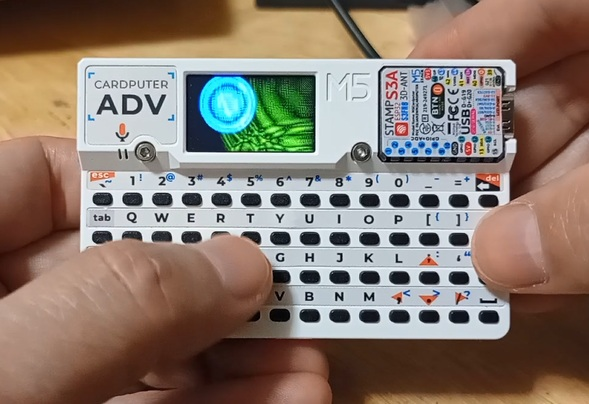

# QWERTY_ripples_cardputerADV
 
 
cardputerADVのキー配置を液晶画面の座標に置き換えて波紋を表示するプログラムです。 
約1/10の確率で文字も表示されます。 
 

既知のトラブル： 
同時押しを多用するとキー入力を受け付けなくなる時があります。 
各所にディレイをいれたりXtaskで並列にしたり無音にしたりしても改善できませんでした。 
どなたか改善していただければ助かりますｗ 
 

